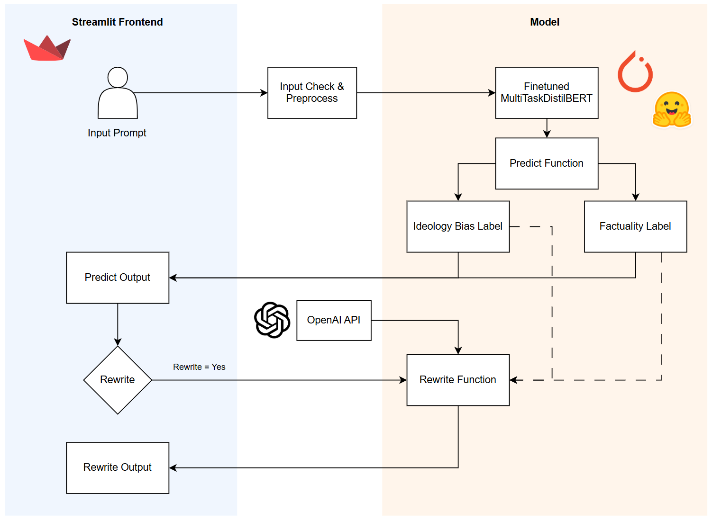

## Motivation

Sources suggest that we spend an average of [7 hours per day](https://www.statista.com/statistics/1380282/daily-time-spent-online-global) on the Internet and upwards of [3 hours](https://explodingtopics.com/blog/social-media-usage) of that on social media. These numbers significantly increases with the younger generation. Unfortunately, these are hours spent on consuming content that is driven by highly manipulative and addicting algorithms.

Because of that, today's world suffers from polarization and misinformation. Internet and social media algorithms are designed to be echo chambers where you are constantly exposed to similarly biased content that slowly polarize your views. News organizations, despite their credibility, are no exception. In fact, polarization is most prominent in politics, and where you get your news greatly influence your political views.

## Solution

Moderately intends to address this problem by helping its users identify politically biased text. Users of Moderately can input text (short text such as news headlines), and Moderately uses a finetuned Transformer to analyze the ideological bias in the text and the factuality of it. While Moderately cannot fact check the given statement, it can detect when text is highly opinionated, giving inattentive readers a warning that the content they are reading is biased. Moderately also provides a way to rewrite the biased text so that it removes said biases.

Moderately is currently a working prototype. My goal is to expand its capabilities and make the model much more robust over time.

## Data 

The data I use come from two sources:The [BABE](https://huggingface.co/datasets/mediabiasgroup/BABE) dataset and the [Political Bias](https://huggingface.co/datasets/cajcodes/political-bias) (short "PoliBias") dataset. The two datasets combined provide around 5,000 short text samples. The BABE dataset contains binary labels for the existence of political leaning and an ordinal factuality scale. The PoliBias dataset contains a 5-scale ideological bias only.

For consistency, I implemented a new labeling scheme that labels the political ideology bias in a 5-scale ordinal format and the factuality in a 3-scale ordinal format for the combined dataset.
In this procedure, I use three "graders" to independently label each text sample, on top of the existing labels provided by the datasets for those that have them (BABE has factuality label, PoliBias has the ideology label).
The graders include two prompt-engineered GPT-4 models that are given altered instructions albeit with the same goal, the original label from the dataset, and myself, a human grader. In the case where all three graders agree, I accept the label. In the case where there is a disagreement but only by a small margin (e.g. 1 vs 2 vs 2), I accept the majority vote. In the case where all three graders disagree, my human grade overrides the others.

The final dataset is then split into train/val/test, and then the train/val dataset is fed into the model for the modeling stage.

## Model 

The baseline model used is a distilBERT model. While other BERT-based models such as base BERT and RoBERTa were experimented with, I chose the distilBERT model due to its computational efficiency. 

A Multi-Head Classification model is built on top of the baseline model, which learns label-encoded ideology and factuality labels from the training data. This baseline model is then fine-tuned on the combined dataset.
Parameters such as learning rate, batch size, and number of epochs were tuned using the Optuna library, and the best-performing model was selected based on the validation set performance.

You can find the comparison between the baseline distilBERT model and the fine-tuned model below. Note that the results shown below are from the validation set, as I am still keen on improving the model before evaluating on the test set.

**Ideology – Per Class and Overall F1 Scores**

| Class   | Baseline | Fine-tuned |
|---------|----------|------------|
| 0       | 0.503    | 0.525      |
| 1       | 0.387    | 0.383      |
| 2       | 0.745    | 0.753      |
| 3       | 0.411    | 0.435      |
| 4       | 0.557    | 0.578      |
| **Overall** | **0.520** | **0.533** |

**Factuality – Per Class and Overall F1 Scores**

| Class   | Baseline | Fine-tuned |
|---------|----------|------------|
| 0       | 0.823    | 0.826      |
| 1       | 0.663    | 0.639      |
| 2       | 0.784    | 0.777      |
| **Overall** | **0.756** | **0.748** |

## Tech

- **Frontend**: Streamlit, Custom CSS
- **Classifier Model**: PyTorch, HuggingFace Transformers (DistilBERT)
- **LLM (Rewrite)**: OpenAI Python SDK
- **CI/Testing**: Pytest
- **Deployment**: Streamlit Cloud
